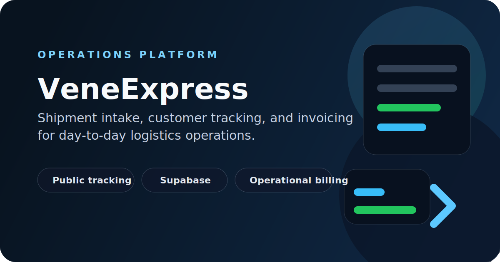

# VeneExpress



Operational shipping software for intake, tracking, and invoicing.

## Problem

Shipment operations break down when customer records, intake, box handling, status updates, and invoicing live across separate tools.

## Solution

VeneExpress brings those workflows into one system: staff can register and move shipments through the operation, administrators can manage rules and approvals, and customers still get public-facing tracking and pricing entry points.

## Key Features

- Customer records with sender and receiver details
- Shipment creation for sea and air workflows
- Box intake with dimensions, barcode-assisted scanning, and shipment association
- Public tracking and pricing-estimator entry points
- Invoice generation, invoice line items, and payment recording
- Role-based access for staff, admin, and read-only users
- Operational settings for approvals, pricing rules, and company configuration

## Stack

- Vite, React, TypeScript, React Router, TanStack Query
- Tailwind CSS and shadcn/ui
- Supabase for Postgres, auth, RPCs, and row-level security
- Supabase Edge Functions for invoice and label generation

## Architecture

- `src/` contains the operational web application and public tracking surfaces.
- `src/integrations/supabase/client.ts` connects the frontend to the owned Supabase project.
- `supabase/migrations/` holds schema history, RLS policies, and backend corrections.
- `supabase/functions/generate-invoice/` and `supabase/functions/generate-label/` handle document workflows.

## Run Locally

### Requirements

- Node.js 18+
- npm

### Environment

Copy `.env.example` to `.env` and set the Supabase values for the target environment.

```sh
cp .env.example .env
```

### Start

```sh
npm install
npm run dev
```

### Useful Scripts

```sh
npm run build
npm run lint
npm run preview
npm run test
```

## Current Status

- Active working codebase used as the maintained source of truth
- Independent from Lovable-managed infrastructure
- Owned Supabase backend is in place and validated for operational flows
- Auth/user recreation and final production cutover are handled as separate controlled steps

## Why It Matters

This project is a practical example of replacing fragmented operational work with software that supports intake, traceability, invoicing, and day-to-day shipping execution in one place.
